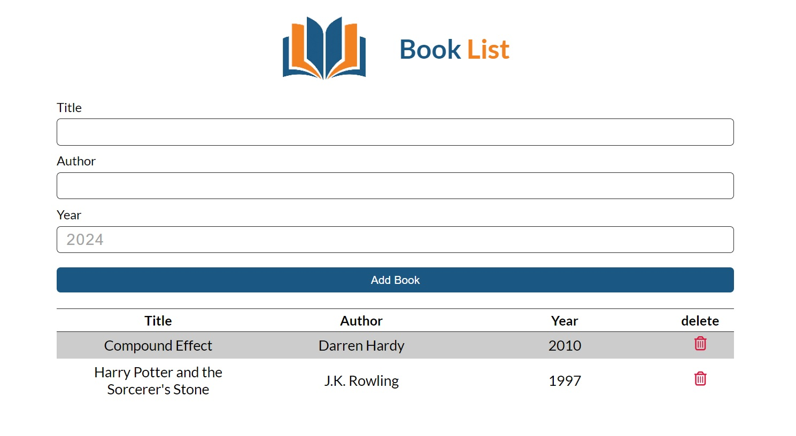

# Book Management App

This application is a simple book management app that allows you to add, delete, and display books. The program is built using JavaScript programming language and browser features.

## Features
- **Add New Book**: You can add new books to the list using the provided form.
- **Delete Book**: You can delete books from the list.
- **Display Book List**: All books in the list are displayed in a table format.

## Usage Guide
1. **Add New Book**:
    - In the "Add New Book" section, enter the book information including title, author, and year of publication.
    - Click the "Add" button to add the book to the list.

2. **Delete Book**:
    - To delete a book from the list, click the delete button corresponding to that book.

## Data Storage
- Book data is stored locally in the browser's local storage (LocalStorage). Therefore, even after closing and reopening the page, book data is retained.

### Note
- Currently, the ability to edit books is not available in this version of the app, and you can only delete books.


### Clone

- Clone the repository:
   ```bash
   https://github.com/amin93k/Book-List.git

---
This program is created using HTML, CSS, and JavaScript and is usable on any browser and device.


